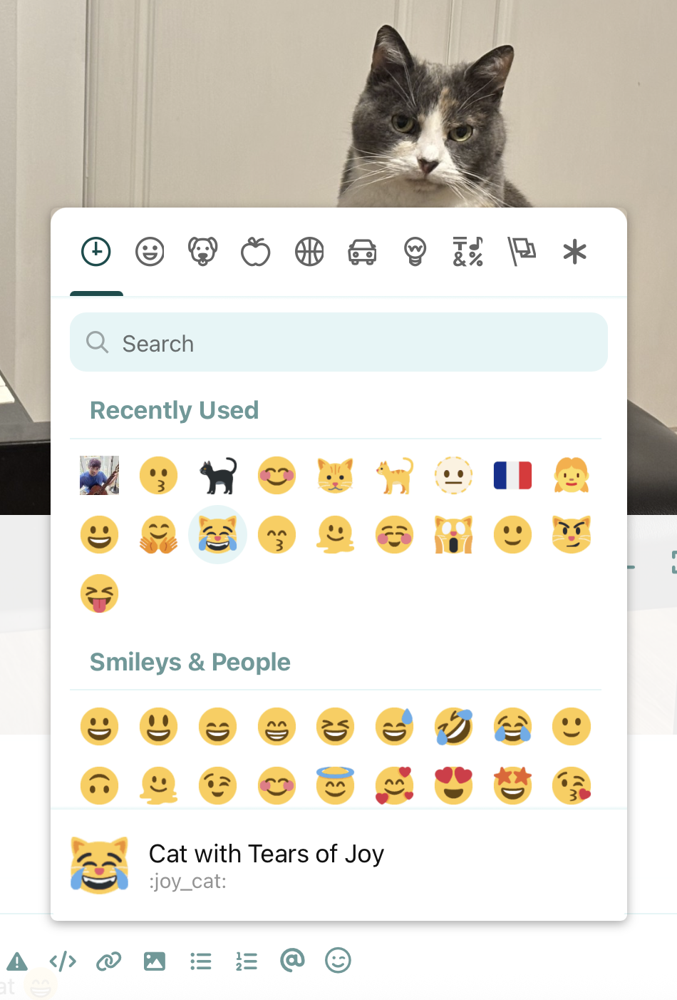

# Flamoji

[](https://github.com/PrimateCoder/flarum-flamoji/blob/master/LICENSE) [](https://packagist.org/packages/pianotell/flarum-ext-flamoji) [](https://packagist.org/packages/pianotell/flarum-ext-flamoji)

Simple emoji manager for Flarum.

> **About this fork:** This is a fork of [`the-turk/flarum-flamoji`](https://discuss.flarum.org/d/28095-flamoji) (originally by [Hasan Özbey](https://github.com/the-turk)). This fork is published as [`pianotell/flarum-ext-flamoji`](https://github.com/PrimateCoder/flarum-flamoji) and was originally created for [🎹 Piano | Tell](https://pianotell.com), but now available to all. It has substantial changes from the original including replacing [emoji-button](https://github.com/joeattardi/emoji-button) with [emoji-mart](https://github.com/missive/emoji-mart). All credit for the original extension belongs to the original author.

Screenshot:



## Features

- Built on [emoji-mart](https://github.com/missive/emoji-mart) (Missive, MIT). Originally based on [joeattardi/emoji-button](https://github.com/joeattardi/emoji-button) — migrated in this fork after the upstream picker was archived.
- Add an emoji picker to the text editor (compatible with dark mode).
- **Picker style is configurable** — choose [Twemoji](https://github.com/jdecked/twemoji) glyphs (sourced from a jsDelivr-hosted spritesheet) or your operating system's native emoji font, or leave the picker on `Auto` to mirror what posts actually display (Twemoji when [`flarum/emoji`](https://github.com/flarum/emoji) is enabled, native otherwise).
- Add custom emojis to the picker.
- Import and export custom emoji configurations.
- Picker code and emoji data load lazily on first open (no impact on initial page load); when Twemoji is selected, the image spritesheet is fetched from jsDelivr on first picker render. Native mode adds zero image bytes.

## Installation

```bash
composer require pianotell/flarum-ext-flamoji
php flarum extension:enable pianotell-flamoji
```

## Updating

```bash
composer update pianotell/flarum-ext-flamoji
php flarum migrate
php flarum assets:publish
php flarum cache:clear
```

## Links

- [Source code on GitHub](https://github.com/PrimateCoder/flarum-flamoji)
- [Changelog](https://github.com/PrimateCoder/flarum-flamoji/blob/main/CHANGELOG.md)
- [Report an issue](https://github.com/PrimateCoder/flarum-flamoji/issues)
- [Download via Packagist](https://packagist.org/packages/pianotell/flarum-ext-flamoji)
- [Original project](https://discuss.flarum.org/d/28095-flamoji)
